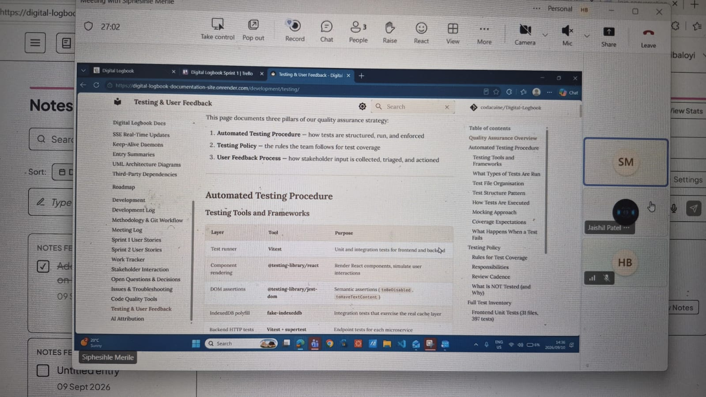

# Stakeholder Interaction

This page documents stakeholder engagement during the Digital Logbook project.

## Sprint 1

### Client Meeting

Below is proof of interaction with the client/stakeholder during Sprint 1. This meeting covered project requirements, expectations, and alignment on the Sprint 1 deliverables.

#### Key Takeaways

- Confirmed the core user flow: sign in, create project, define entry format, capture entries, view timeline, see statistics
- Agreed on the technology stack (React frontend, Node/Express microservices, Supabase backend)
- Discussed the importance of the natural-language entry feature and voice capture
- Aligned on deployment strategy (Render for backend services)

## Sprint 2

### Client Meeting — 10 September 2026

**Venue:** Discussion Room 3, Wartenweiler Library (in person)
**Attendees:** Hlulani, Siphesihle, Lupa, Sicelo, Zamo, Nasiphi (full team) + client/tutor

**Context:** Sprint 2 progress demonstration and user testing session with the client.

**What we did:**

- Demonstrated our current progress on the Digital Logbook application to the client. The demo followed the full user journey agreed in the 9 September standup: signing in, creating a project, capturing an entry with the live timer running, viewing the dashboard (both project-centric and entry-centric views), and reviewing the statistics panel.
- The client responded positively and liked what was shown. Specific praise went to the toggleable dashboard, the more prominent entry button, and the entry-card sizing fixes carried over from the Sprint 1 feedback.
- Conducted a user testing session where participants tested the app and provided comments and feedback. Participants completed a scripted set of tasks (create a project, log an entry, start and stop the timer, archive a completed item) and narrated any points of confusion.
- Captured the user-testing comments for review — most feedback concerned small UI wording issues and a request for clearer timer labels, which the team agreed were quick wins for the next cycle.

**Decisions made:**

- Client feedback and user testing comments will be reviewed and incorporated into the next development cycle.
- The requested timer-label clarification will be handled together with the ongoing Timer/Stats work rather than as a separate item.

**Next step decided:**

- Transcribe the user-testing comments into the project documentation and convert them into backlog items for Sprint 2.
- Schedule the next client check-in after the Timer/Stats feature is finalised.

**Proof of meeting:**

### Stakeholder Feedback Review — 12 September 2026

**Venue:** Online (Microsoft Teams)
**Attendees:** Hlulani, Siphesihle, Lupa, Sicelo, Zamo, Nasiphi (full team)

**Context:** Internal review of the stakeholder feedback collected during the 10 September demonstration and user-testing session, with the project demonstration revisited to confirm every feedback point against the live build.

**What we did:**

- **Stakeholder feedback review:** Grouped the client and user-testing comments from the 10 September session into quick wins (small UI wording, clearer timer labels) versus items needing design discussion (larger changes logged for the next sprint).
- **Project demonstration:** Re-ran the demonstration scenarios from the client meeting against the current build — signing in, creating a project, capturing an entry with the timer, viewing the dashboard, and reviewing the statistics panel — to confirm the feedback items reproduce and are properly scoped.
- Each team member confirmed the part of the demonstration they own:
  - **Hlulani:** Timer label and entry-card copy changes requested during user testing — the UI now clearly distinguishes the deadline countdown from the work-session timer.
  - **Siphesihle:** Updated timer behaviour with pause/resume, with the Stats module totals staying in sync.
  - **Lupa:** Archive-flow feedback incorporated, with tightened confirmation prompts.
  - **Sicelo:** Statistics panel verified against the user-testing scenarios.
  - **Zamo:** Activity-log entries linked to the user actions observed during the testing session for traceability.
  - **Nasiphi:** Next client check-in scheduled and the stakeholder feedback summary prepared for this log.

**Decisions made:**

- All quick-win stakeholder feedback from the user-testing session will be completed within the current sprint; larger items go to the Sprint 3 backlog.
- The next stakeholder check-in will focus on a demonstration of the corrected timer and stats behaviour.

**Next step decided:**

- Finalise and merge the Timer/Stats changes via merge request.
- Publish the updated documentation, including the expanded meeting logs and stakeholder-interaction evidence.

**Proof of meeting:**

