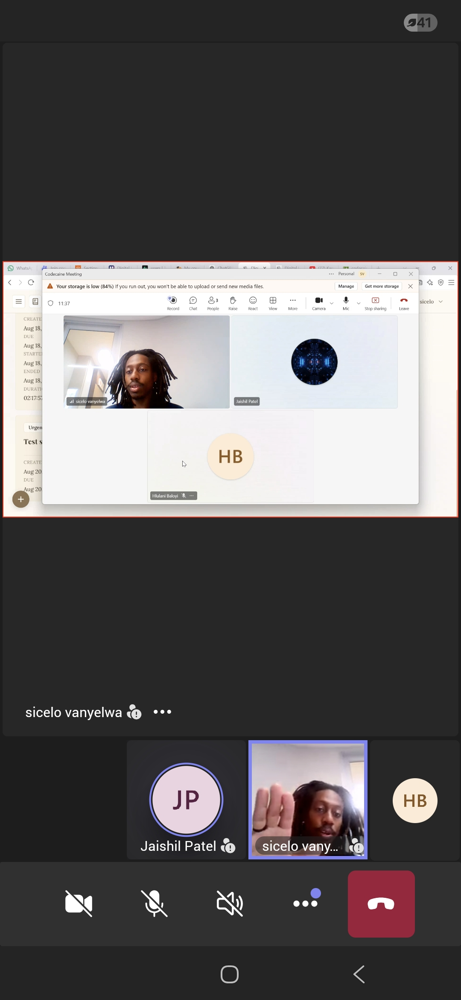

# Stakeholder Interaction — Sprint 1

This page documents stakeholder engagement during Sprint 1 of the Digital Logbook project.

## Client Meeting

Below is proof of interaction with the client/stakeholder during Sprint 1. This meeting covered project requirements, expectations, and alignment on the Sprint 1 deliverables.

### Key Takeaways

- Confirmed the core user flow: sign in, create project, define entry format, capture entries, view timeline, see statistics
- Agreed on the technology stack (React frontend, Node/Express microservices, Supabase backend)
- Discussed the importance of the natural-language entry feature and voice capture
- Aligned on deployment strategy (Render for backend services)
